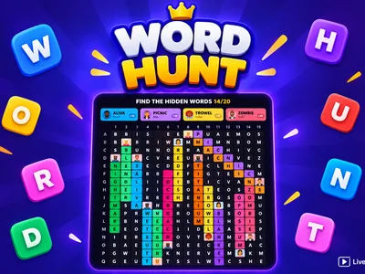
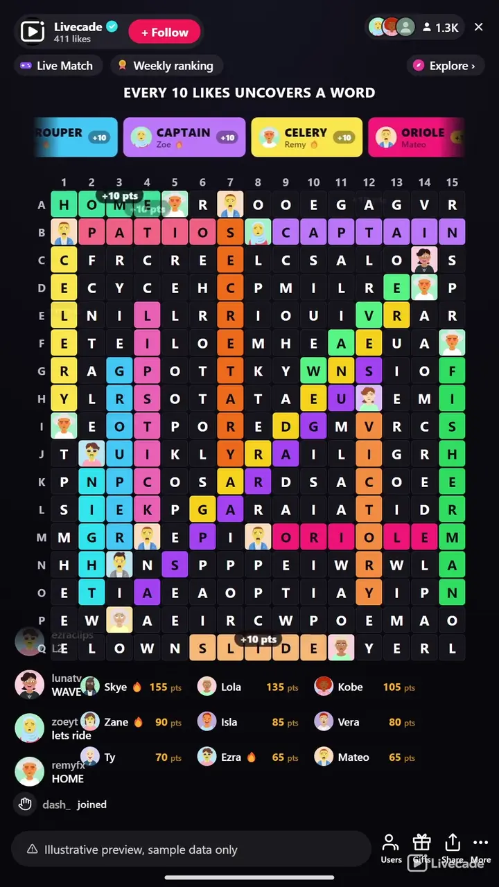

# Word Hunt - Interactive TikTok Live Game

> Twenty hidden words, one grid, and a chat that can type the word or just call out the square.

A grid of letters hiding twenty words, and a chat that can play it two ways. Type a word you spot, or just call out a square like C7 and the whole word it belongs to lights up with your face on it. Nothing to know in advance, nothing to install.

**[Play Word Hunt on Livecade](https://livecade.io/games/word-hunt/?utm_source=github&utm_medium=readme&utm_campaign=word-hunt)** - runs as a single browser source in OBS, Streamlabs, or TikTok LIVE Studio. Nothing for viewers to install.

## How viewers play

Viewers take part with the actions TikTok already gives them: **comments**, **gifts**, **likes**, **follows**, **shares**. Every action below is rebindable, so you decide which interaction drives which effect.

| Action | What it does |
| --- | --- |
| **Guess a word or a square** | Any comment is checked twice: once as a word on the board, once as a coordinate like C7. Either one uncovers the whole word and credits the viewer with their avatar on it |
| **Uncover a word** | A gift, like, follow, share, join or keyword reveals the longest word still hidden, credited to whoever triggered it. Bound to a gift by default so viewers can discover it |
| **New board** | Throws away the current board and generates a fresh one. Ships unbound, since it discards work the chat has already done |

## How it works

### Type the word, or name the square

Both count. Typing a word you spotted uncovers it, and so does naming any single square it runs through, so a viewer who can see the letters but not the word still has a way to score.

### Your face lands on the word you found

Each solved word takes its own colour across the grid and keeps the finder avatar pinned to it for the rest of the board. Crossing words share the cell and both colours show through.

### Every board is generated live

The grid is built at the moment the board starts, from your own word bank, so boards never repeat and never run out. Three measured board sizes, from a quick thirteen-by-fifteen to a twenty-four word grid.

### A nudge when the room goes quiet

If nobody has found anything for a while, the first letter of an unsolved word pulses for a second. It never says which word, so it unsticks the board without solving it. Turn it off in one click.

## About the game

Word Hunt puts a word search on your stream and hands it to the whole chat at once. Twenty words are hidden across a fifteen-by-seventeen grid of letters, forwards, downwards and diagonally, and every one of them is there to be found by anyone watching. There is no turn order and no queue: a viewer who arrives thirty seconds before the board is finished can still take the last word.

### Two ways in, so nobody is locked out

Spotting a word and typing it works, which is the game everyone already knows. But the grid also carries row letters and column numbers, so a viewer who can see letters but cannot quite pin the word can name a single square, like C7, and if any hidden word runs through it the entire word uncovers and they are credited with it. That second route is the reason a slow reader and a fast one can play the same board.

### The board fills up with the people who solved it

Every found word paints its own colour across the letters it occupies, and the finder profile picture pins to the end of it and stays there. Words that cross share a cell and both colours show. By the time a board is finished it is a map of who was watching, which is what makes the screenshot at the end worth taking.

### Boards build themselves, so they never repeat

The grid is generated live at the start of every board from your own word bank, in about a tenth of a millisecond, rather than being drawn from a fixed pack. Nothing repeats, nothing runs out, and every language gets boards built from its own words rather than translations of an English one.

## What it looks like on stream

[Watch Word Hunt gameplay](https://cdn.livecade.io/games/word-hunt.mp4)

## What you can configure

- **Language** - Eleven languages, each drawing on its own word bank
- **Board size** - Quick, standard or large, three combinations measured to always generate cleanly
- **Hide words diagonally** - Diagonal placements on or off
- **Hide words backwards** - Off by default, since a reversed word is realistically only reachable by naming a square
- **Seconds between guesses per viewer** - A per-viewer cooldown, so one person cannot brute-force squares
- **Seconds before a new board** - How long a finished board stays up before the next one builds
- **Show who found each word** - Pins the finder avatar and name to the word they got
- **Flash a hint when the board stalls** - Lights up the first letter of a word nobody has found, on your own interval. Off is a single toggle
- **Show points leaderboard** - With how many entries to show and how many per line
- **Background colour or image** - Or transparent, to sit over your camera
- **Your word bank** - Hide, restore or add words in your language from the content manager

## Languages

English, Spanish, Portuguese, French, German, Italian, Indonesian, Turkish, Russian, Romanian, Filipino

## FAQ

<strong>How do viewers play Word Hunt?</strong>

They type in chat. If they spot a hidden word they can type the word itself, and if they cannot quite see it they can name a single square instead, like C7. Any square that a hidden word passes through uncovers that whole word, so both routes score the same.

<strong>What is the point of guessing a square?</strong>

It lets someone play who can see the letters but cannot pin the word, which on a grid of two hundred and fifty five letters is most people most of the time. It also gives a viewer something to do the second they arrive, without reading the whole board first.

<strong>What happens on a wrong guess?</strong>

The square flashes and nothing else. There are no strikes and no penalty, because the game is cooperative, and a word someone already found is ignored quietly rather than marked wrong. A short per-viewer cooldown keeps one person from trying every square in a row.

<strong>What do gifts do?</strong>

A gift uncovers the longest word still hidden, credited to the sender with their picture on it. The same action can be moved onto likes, follows, shares, joins or a chat keyword instead, so it does not have to be a gift at all.

<strong>Is there a time limit?</strong>

No. A board stays up until its last word is found, so a quiet chat is never cut off mid-board and a slow stretch does not cost anyone the round. When the board is finished a new one builds itself a few seconds later.

<strong>Do the boards ever repeat?</strong>

No. Every grid is generated at the moment the board starts rather than pulled from a fixed set of puzzles, so there is no pack to exhaust and no chance of the same board twice.

<strong>Do accents and spelling count?</strong>

A word matches once accents are folded, so a word typed without diacritics on a phone still matches the accented spelling. Words with spaces or hyphens are filtered out of the bank entirely, since they cannot be placed in a letter grid.

<strong>How do I add Word Hunt to my TikTok Live?</strong>

Add one browser source URL to OBS or your streaming software and go live. There is no plugin to install and nothing for your viewers to download.

## Setup

1. [Create a Livecade account](https://app.livecade.io/register?utm_source=github&utm_medium=cta&utm_campaign=word-hunt)
2. Copy your overlay browser source URL
3. Paste it into OBS, Streamlabs, or TikTok LIVE Studio
4. Pick Word Hunt, set your triggers, and go live

Runs in the browser, so it works on Windows and macOS with nothing to download. [See all TikTok Live games](https://livecade.io/tiktok-live-games/?utm_source=github&utm_medium=readme&utm_campaign=word-hunt).

---

_This repository documents Word Hunt, a hosted interactive game by [Livecade](https://livecade.io/?utm_source=github&utm_medium=footer&utm_campaign=word-hunt). The game runs on Livecade's platform, so there is no source to install here._
